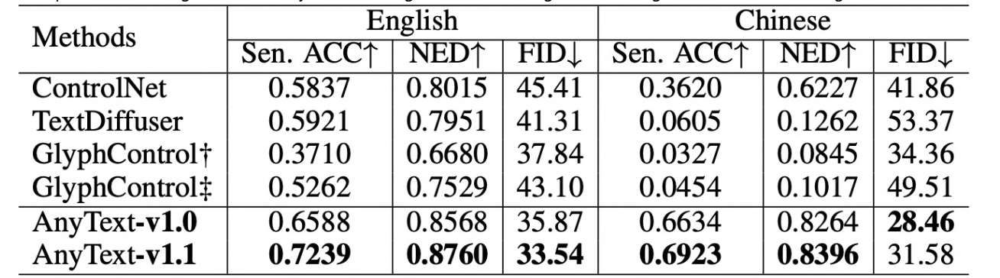
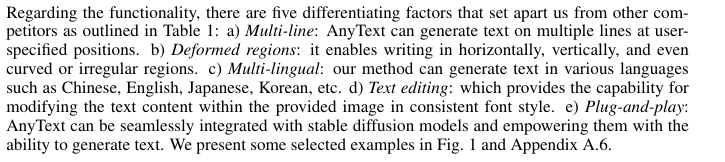

### **1. 系统概述 (System Overview)**

- **产品目标与愿景:** 

​	本产品的核心目标为构建一个基于生成式AI的文创产品生成系统，旨在解决目前人们对文创产品的审美需求与设计需求，未来将考虑更加个性化的生成用于服务用户需求。

- **目标用户:** 

​	本产品的目标用户群体为文创产品爱好者以及文创产品设计工作者，这些用户具有较高的审美门槛。

- **产品范围:** 界定AI产品的功能边界，哪些功能包含在内，哪些不包含。

​	本产品目前的功能为通过用户合理输入生成符合中华人民共和国宪法法律的相关文创图片，不用于生成成人、政治敏感、违法犯罪内容，不用于生成视频。

- **与现有系统的关系:** 如果AI产品需要与其他系统集成，需要说明它们之间的关系和交互方式。

​	 我觉得可以不用写，如果不需要的话可以删掉

- **假设与依赖:** 列出在编写需求时所做的关键假设，以及产品运行所依赖的外部因素（例如，特定的数据源、API等）。

​	本项目假设用户将合法使用本产品，产品运行需要相关服务器，相关接口，相关数据集。

### 2.总体设计

#### 2.1 系统架构:

- **用户界面 (Frontend)**:
  - 用户通过浏览器或应用程序客户端与系统进行交互。
  - 提供文字输入框、图片上传功能、文字位置和样式标注工具、文创风格选择器、生成按钮、结果预览区域以及保存和分享功能。
  - 使用现代 Web 前端技术栈（Gradio）构建。
- **后端 API (Backend)**:
  - 接收来自前端的请求，处理业务逻辑，并协调各个服务模块。
  - 使用 Python (例如：Gradio) 开发。
- **AI 模型服务 (AI Model Service)**:
  - 部署和运行核心的 AI 模型，负责根据用户输入生成创意图片。
  - 可以进行图文融合。
  - 包含文本编码器用于理解文字输入。
  - 需要强大的计算资源来支持模型推理。

#### 2.2 系统组成（软、硬件):

- **软件组成**:
  - **前端应用:** 使用 Gradio 库构建的 Web 界面。
  - **后端 API 服务:** 基于 Python (Gradio 或其他框架) 开发的。
  - **AI 模型**:
    - **基础模型:** 类似 Stable Diffusion 1.5 的预训练扩散模型。
    - **微调模型 (可选):** 基于特定文创风格或数据集进行微调的模型，以生成更符合特定需求的图片。
    - **文本编码器:** 用于将用户输入的文字转换为模型可以理解的特征向量。
  - **依赖库**:
    - **Gradio:** 用于快速构建用户界面和 API。
    - **PyTorch 或 TensorFlow:** 用于加载和运行 AI 模型。
    - **Transformers 库 (Hugging Face):** 提供预训练模型和相关工具。
    - **Pillow (PIL):** 用于图像处理。
- **硬件组成**:
  - **服务器**:
    - **API 服务器:** 运行后端 API 服务的服务器，需要具备一定的 CPU 和内存资源。
    - **AI 模型服务器:** 搭载高性能 GPU (例如：NVIDIA RTX 系列或更高) 的服务器，用于加速 AI 模型的推理计算。根据预期用户量和性能需求，可能需要多台 GPU 服务器。
  - **用户终端:** 用户使用的电脑、平板电脑或手机等设备，只需要能够运行现代 Web 浏览器即可访问前端界面。

#### 2.3 数据设计:

- **模型数据**:

  - **模型权重文件:** 与AnyText模型结构相同的权重文件。
  - **模型配置文件:** 存储模型结构、超参数等信息的配置文件。

- **生成图片数据（可自行调整）**:

  - **生成的文创图片文件:** 存储实际生成的图片文件 (例如：`.png` 或 `.jpg` 格式)。

  - 图片元数据:

     记录生成图片的相关信息，例如： 

    - 生成时间
    - 使用的模型版本
    - 对应的用户输入参数
    - 分辨率
    - 文件大小

### **3. 功能需求 (Functional Requirements)**

**方式一：基于用户输入的文字**

1. **文字输入:** 用户可以在界面上提供的文本输入框中键入或粘贴想要使用的文字内容，例如一句诗词、一句格言、一个祝福语、或者任何简短的文本。
2. **供参考的物品**：用户可以在界面上看到所有进行加强训练的物品，模型在生成这些物品的准确率上有一定的保证，同时也可以看到比较优美的一些例子，供用户参考。
3. **文字位置标注**:
   - **自由拖拽模式:** 用户可以使用鼠标在预览区域内拖拽一个矩形框，以指定文字将要放置的位置和大致大小。
   - **预设位置选择:** 系统可以提供一些常用的预设位置选项（例如：居中、左上角、右下角等），供用户快速选择。
4. **图片生成:** 用户点击“生成”按钮后，AI 产品将根据用户输入的文字、标注的位置、选择的文字样式和文创风格，生成一张带有文字的创意图片。
5. **结果预览与调整:** 生成的图片会显示在预览区域，用户可以查看效果。如果对结果不满意，可以返回修改文字内容、位置、样式或风格，然后重新生成。
6. **保存与分享:** 用户可以将生成的文创图片保存到本地设备，或者分享到社交媒体平台。

**方式二：基于用户输入的成形图片**

1. **图片上传:** 用户可以通过文件上传功能上传一张已经存在的图片作为创作的基础。支持常见的图片格式，例如 JPG、PNG 等。
2. **供参考的物品**：用户可以看到一些比较优美的例子，但仅供参考。
3. **文字位置标注**:
   - 与方式一类似，用户可以使用自由拖拽模式或预设位置选择在上传的图片上标注文字将要放置的位置和大小。
   - 用户可以添加多个文本框，标注多个文字的位置。
4. **文字内容输入与样式定制:** 对于每个标注的位置，用户可以输入相应的文字内容。
5. **图片生成:** 用户点击“生成”按钮后，AI 产品将在用户上传的图片上，根据标注的文字位置和样式，以及添加的其他文创元素，生成最终的文创图片。
6. **结果预览与调整:** 生成的图片会显示在预览区域，用户可以查看效果。用户可以调整文字的位置、样式，或者添加/修改其他文创元素，然后重新生成。
7. **保存与分享:** 用户可以将最终生成的文创图片保存到本地设备，或者分享到社交媒体平台。

**总而言之，该 AI 产品旨在提供一个简单易用、功能丰富的界面，让用户能够通过输入文字或上传图片，并灵活地标注文字的位置和定制样式，最终生成具有个性化创意的文创图片。**

### **4. 性能指标 (Performance Metrics)**

**AnyText-v1.1** 在各类语料上的性能都较为优秀，可以完成我们当前的任务。

### **5. 接口需求 (Interface Requirements)**

- **应用程序接口 (API) 需求:** 并不调用其它应用程序接口。
- **数据接口需求:** Gradio 本身主要负责用户界面的展示和与后端 Python 代码的交互，它不直接处理与外部数据源的连接。
- **硬件接口需求**：不需要。

### **6. 其它要求 (Other Requirements)**

- **5.1 安全性、可靠性、可维护性等要求**:
  - **安全性**:
    - 数据隐私保护：确保对话发生在本地，不收集用户数据。
    - 防止恶意攻击：强化防御体系，防止恶意攻击。
    - 访问控制：对于进行过恶意访问的IP进行拉黑，减少恶意访问量。
  - **可维护性**:
    - 代码的可读性与可扩展性较好，详细注释了大部分功能。
    - 代码易于部署，容易维护。
- **5.2 运行环境要求**:
  - **硬件要求:** GPU 4060 8GB显存
  - **环境要求:**见https://github.com/SPM-PSP/PSP25-1/blob/main/codes/front_back_ends/environment.yaml
  - **网络要求:** 有网即可。

### **附录:**

- **A 术语与缩略语:** 

  AnyText：发布的一种模型，对文字渲染进行了强化训练。

  sd1.5：Stable Diffusion v1-5。

  Gradio：Gradio是一个开源的 Python 库，用于快速构建机器学习和数据科学模型的交互式 Web 界面。

**针对AI产品的额外考虑：**

- **数据需求:**文字和图片数据。
- **模型部署和监控:** 在满足上述要求的服务器上，运行脚本进行部署，远程连接（todesk）可进行实时监控。

### **总结:**

本产品是一个基于生成式 AI 的文创图片生成系统，旨在帮助文创爱好者和设计者通过输入文字或上传图片并标注文字位置，快速生成创意图片。系统采用 Gradio 构建前后端，使用类似 Stable Diffusion 1.5 的 AI 模型进行图文融合。部署需要 GPU 服务器。用户可以输入文字或上传图片进行创作，并可对文字位置和样式进行调整，最终保存和分享作品。

